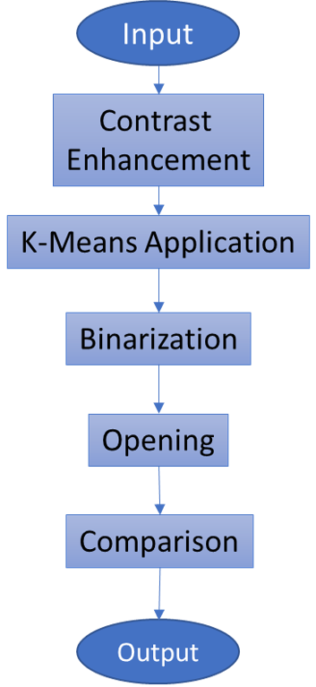

# MRI-Brain-Tumor-Segmentation

## Objective

This repository includes the K-means pipeline of the final project prepared for the image processing course.

The objective is to segment tumors in Brain MRI images with K-Means, one of the unsupervised clustering methods.

## Flowchart

## Input

Brain Tumor Segmentation (BraTS) Challenge 2021 Task 1 [BraTS](https://www.kaggle.com/dschettler8845/brats-2021-task1 "BRaTS 2021 Task 1 Dataset") dataset is used.

The dataset includes 3D MRI co-registered and skull-stripped scans that describe : 
- Native T1, 
- Post-contrast T1-weighted, 
- T2-weighted, 
- T2 Fluid Attenuated Inversion Recovery (FLAIR),
- Manually annotated segmentation. 

## Environment

Google Colaboratory
Python 3.6.9

## Outputs 

